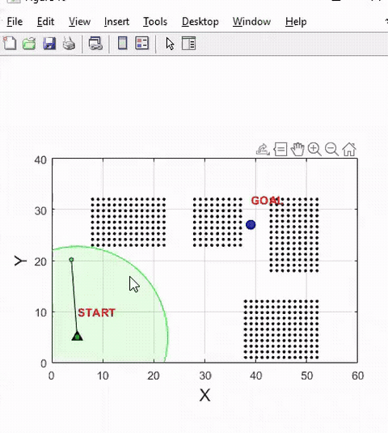

# Modified RRT with Safety Certificates for Multi-Robot Path Planning

**Safety-certificate collision checking cuts RRT node-sampling runtime by 6× for obstacle-free multi-robot industrial path planning.**

📄 [**Report — view in browser**](https://docs.google.com/viewer?url=https%3A%2F%2Fraw.githubusercontent.com%2FLokesh97Bansal%2FPath-Planning-with-RRT-with-Safety-Certification-and-APF%2Fmain%2FReport.pdf) · 🎞 [**Slides — view in browser**](https://docs.google.com/viewer?url=https%3A%2F%2Fraw.githubusercontent.com%2FLokesh97Bansal%2FPath-Planning-with-RRT-with-Safety-Certification-and-APF%2Fmain%2FSlides.pdf) · 🎬 [Full-quality video (MP4)](./video.mp4) · [PPTX](./PPT.pptx)

## Overview
Sampling-based planners such as RRT spend most of their runtime on collision checking. This project modifies RRT with **safety certificates** — regions around sampled states that are provably collision-free — so that many candidate nodes can be accepted or rejected without a fresh collision query. The planner generates obstacle-free paths for an assembly of industrial robots moving to a static goal among static obstacles; a Dijkstra pass extracts the optimized path over the resulting tree.

## Method
- RRT node sampling with certificate-based collision checking: a certified safe radius around each validated state short-circuits redundant queries.
- Multi-robot setting: an assembly of ground robots planned jointly toward a static goal with static obstacles.
- Dijkstra over the constructed tree for efficient, optimized path extraction.

## Result
- **~6× reduction in RRT node-sampling runtime** versus the baseline planner, from certificate-based collision checking alone.

## Context
Graduate research project, Robotics & Autonomous Systems, **IISc Bengaluru** (Apr–May 2022). Related manuscript in preparation: *"Modified RRT with safety certificates for multi-agent path planning."*
